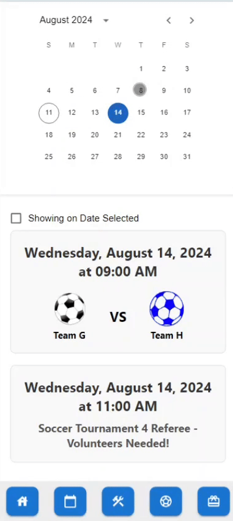

# Clubhouse Cafe App

## Problem
At the start of 2024, South Bronx United (SBU) launched the Clubhouse Cafe to enhance career development for young adults. However, despite this initiative, SBU faces challenges to raise awareness of the broader mission of the organization to Clubhouse Cafe customers, which is to support the youth of South Bronx academically and socially through soccer. During a field research trip to the cafe, we interviewed two first-time customers, who were unaware of the SBU organization despite them being there for over an hour. In a stakeholder meeting, a regular customer mentioned how she only became involved with SBU volunteering not through the cafe that she frequented for four times a week, but through a neighbor who informed her about possible initiatives with the organization. These examples stress the need for a **mobile app to notify and enable customers to learn about events that SBU offers, encourage volunteering, provide a platform to donate and interact with Clubhouse Cafe products**.

## Requirements
### Fundamental Requirements
* Establishing connection of customer with SBU messaging
    * Prioritizing customer awareness around current SBU and Clubhouse Cafe initiatives and events
* Accessible ways to donate
    * Customers must be able to donate easily across many different platforms
* Accessible registration and volunteering
    * When notified of SBU volunteering events, such as refereeing soccer games or helping as academic tutors, there must be a streamlined registration process for customers.

### Non-functional
* Clean UI and easy user experience
    * Not many customers of the app are technologically inclined, and the app must be developed with this in mind
* Scalability
    * App must be able to scale to hundreds or even thousands of users
* Security
    * App must secure and encrypt user data 

### Functional
We want to design an app that has the following requirements:
* User Registration and Authentication
    * Users should be able to create and register accounts
* User Profiles
    * Users should be able to customize their own profiles that include but not limited to:
        * Profile picture
        * Contact info (phone number, email address)
        * Bio
    * Must be able to give admin privileges to certain users, allowing them to manage the rest of the system (i.e., donations, volunteering opportunities, events, news)
* Donation system 
    * App must be able to support a robust donation system that spans multiple donation platforms
* Volunteer/Event Notifications
    * App must be able to support a push notification system that notifies users about future Clubhouse Cafe/South Bronx United events and promotions.
* Volunteer Registration
    * Users must be able to register for volunteer opportunities
* Stories and News
    * App must be able to support:
        * A feed for stories about current and past SBU members/Clubhouse Cafe baristas
        * Local news stories about SBU and Clubhouse Cafe
* Menu
    * Users must be able to view a menu of current Clubhouse Cafe products
* Analytics and Metrics Tracker
    * App must be able to collect analytics and metrics, such as but not limited to:
        * Number of registered users
        * Number of users who registered for certain events
        * Number of donations
        * Number of views on stories and posts (tentative)
    * Would be beneficial for administrators to see the effectiveness of the app and various marketing schemes to advertise the app

### Optional Features
These features aren’t necessary to the main functionality of the app but could be helpful. 

* Loyalty and Rewards Program
    * The current loyalty and rewards program depends on CashApp, which would be sent through a text message. After talking to some customers, it could be confusing to access the rewards and see how many points one has.
    * Could be beneficial to implement a feature that would communicate with CashApp and allow users to easily see their points in the app
    * However, this feature is not necessary to the main purpose of the Clubhouse Cafe App
* Online ordering system
    * While an online ordering system may be more convenient for the customer and boost sales of Clubhouse Cafe, it could undermine the face-to-face connection between the baristas and customers, which was heavily emphasized in multiple stakeholder meetings. 
    * Baristas have told us the value of customers hearing their stories, which encourages them to donate to South Bronx United.
* Feedback
    * Allow users to provide feedback on the app
 
## Design
Below, we have a rough skeleton of what we envision the app to be. Here are images and descriptions of the five pages we made: 
### Key Features
- Home
    - Cafe logo
    - General description
    - Hours listed

	

- Events Calendar
    - Calendar component
    - Events list
    - Filtering of events list using calendar dates
 

	

- Volunteering
    - List of volunteering events
    - Sign-up feature
 

	

- Stories
    - Individual posts about students in the organization
        - Name
        - Photo
        - Description/Story
    - Snap-scrollable view to transition between stories
    - Features to interact with posts
        - Like
        - Comment
        - Share

	

- Donations
    - Name
    - Email
    - Phone Number
    - Donation amount

	

#### Please go to `application/README.md` to learn how to run this project on your own machine!
